# PEST
## PEST分析模型

分析宏观环境的工具，从 政策（P）、经济（E）、社会（S）、技术（T） 四个维度分析外部因素。

| PEST | 因素|
|--- | --- |
|政策 |国际环境、制度体制、巨石形式、税收政策、财政政策、产业政策、投资政策、相关补贴、法律法规 |
| 经济 | GDP/PPI、可支配收入、消费结构、利率汇率、事业了、通胀率、储蓄信贷 |
| 社会 | 人口规模、出生率、性别年龄、生活方式、教育情况、价值观念、风俗习惯、审美偏好、职业岗位 |
| 技术 | 现有技术、更新速度、普及率、供应链、商品化速度、新发明、技术淘汰、基础研究突破 |

## PEST模型扩展
### PESTE

加入了E（自然环境），比如气候、光照、适度、土壤。农产品企业在建厂时就需要考虑自然环境。

### PESTLE
政策、经济、社会、技术、法律、自然环境。把法律从原来的分类中单独拿出来做重点研究，这样的分离取决于所处行业、所处阶段的特点。

### PEST分析例子：个人职业发展方向

| PEST | 因素|
|--- | --- |
|政策 | 城市环境、房价水平、人才吸收政策 |
| 经济 | 收入水平、消费水平、集活跃度 |
| 社会 | 文化管理、生活习惯、男女比例 |
| 技术 | 发达程度、设施完善、舒适便利 |

## 适用场景
**作用**：分析外部宏观环境因素对产品/行业的影响。

- 新业务、新市场调研

- 产品战略规划

- 竞争格局判断

---
# 波特五力模型
评判一个市场吸引力高低。

    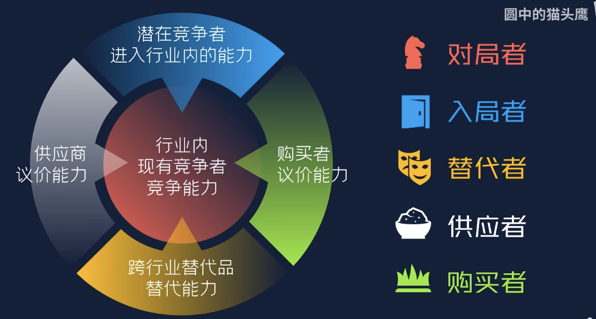

### 对局者（行业内对手）

价格战、附加值竞争、产品功能差异化、产品线组合策略、营销宣传竞争、品牌价值竞争。

### 入局者（刚入行的新手）
入局者入局看中两点：入行门槛、利润高

外行可以通过收购行业内的企业直接空降进入行业

### 替代者（不是对手的对手）
技术突破、跨行业变革：高铁对于城际巴士

客群习惯：网购对于线下购物

### 供应商
供应商的不可替代性

企业自产自销

不缺销路的供应商

### 购买者
大客户购买量大有强大的议价能力

#### 可口可乐例子

    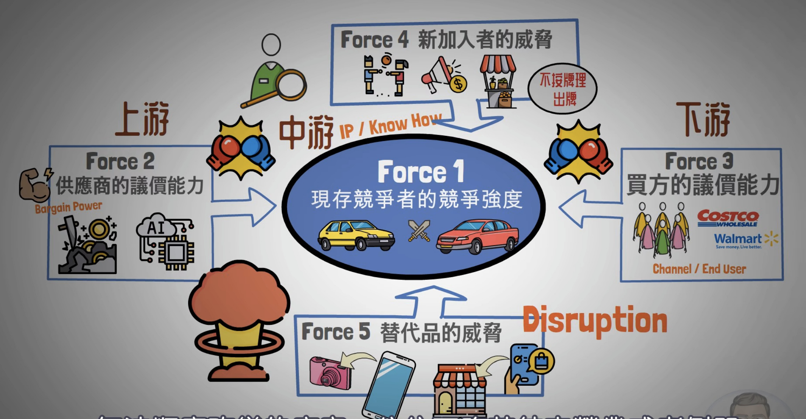

可口可乐**自由配方**，所以供应商议价能力非常薄弱。可口可乐通过绵密的销售网络，通过多方销售渠道进入到消费者手里，削弱采购商的议价能力。面对新进入的竞争者，可口可乐公司定价在合理范围，且持续输出自有品牌。替代品有矿泉水、茶水、果汁等，可口可乐进行多角化经营，可口可乐也开始经营果汁、茶水、矿泉水等。

    

随着人们的健康意识越来越强，碳酸饮料被人们纳入到不健康饮品的行业，于是可口可乐公司推出了无糖版、零卡版可乐。

## 适用场景
**作用**：判断行业是否容易赚钱，行业竞争程度如何。

- 新行业进入前评估

- 产品战略、商业化分析

- 投资/竞争对手研究

---
# AARRR模型

AARRR分别代表五个单词：Acquisition（招新）、Activation（激活）、Retention（留存）、Revenue（收入）、Referal（用户推荐）

    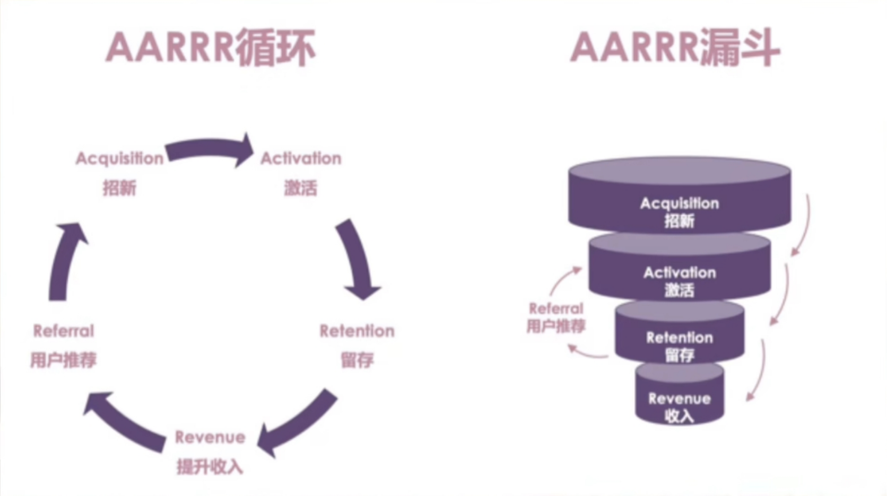

**Aquisition（招新）**：为平台带来新的注册用户，为品牌带来新的消费者

- 招新对于不同的业务有不同的标准：app以注册为标准、一件衣服在天猫上卖出，首次购买就为招新。

**Activation（激活）**：成为新用户后首次完成关键步骤，活跃用户

- 激活对于不同的业务有不同的标准：小红书的激活可能是浏览、对于keep这款软件来说，激活可能是用户完成了一次锻炼。

- 算作激活的时间跨度对于不同的业务有不同的标准：激活行为门槛越高，激活周期容忍度越长。对于小红书Activation的周期就比较短，keep就比较长。

对于品牌方来说Aquisition和Activation都是购买行为，这两者有何区别？

对于高端品牌来说，注册会员可能就算Acquisition了，购买行为就为Activation。一般的品牌来说，首次购买作为Aquisition，复购行为作为Activation。主要就是根据不同的业务做不同的分别。

**Retention（留存）**：用户在平台持续进行关键行为，持续购买，保持活跃。

- 留存期不同业务有不同的标准：对与keep用户每周完成一次锻炼就很活跃了，但对于王者荣耀可能就是每天或每两天都玩才算活跃，化妆品周期就会更长。

**Revenue（收入）**：用户在拍平台产生的收入，在品牌方购买的增加。

- 例如keep商城中售卖健身器材、付费会员。

- 提升的关键在于将活跃用户转化为付费用户；从低消费用户转为高消费用户。

**Referal（用户推荐/社交裂变）**：通过已有用户去做新一轮招新，从而完成AARRR循环。

- 推荐有优惠券，分享朋友圈，推荐码、砍一刀等

## 适用场景
**作用**：分析增长全链路，找出增长瓶颈。

- 增长产品、运营分析

- 用户生命周期分析

- 增长实验指标设计

---
# PDCA模型

Plan（计划）、DO（执行）、Check（检查）、Action（行动）

**Plan**：

1. 收集信息
2. 分析情况
3. 确认目标
4. 制定计划

**Do**：落地执行

**Check**：

1. 评估效果
2. 分析原因
3. 总结经验

**Action**：

1. 标准化
2. 问题保留

PDCA循环可以大环套小环，在每一个具体步骤中，在进行精细化制定PDCA环。

    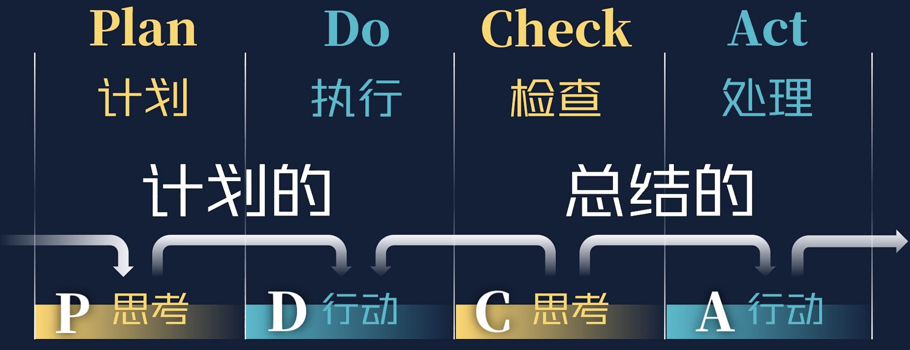

Plan是对未来行动的思考。Do是对Plan的执行；Check是对过去的思考，Act是对Check的执行。这样来看PDCA模型就是一个在思考与行动之间不断转化循环的模型。

    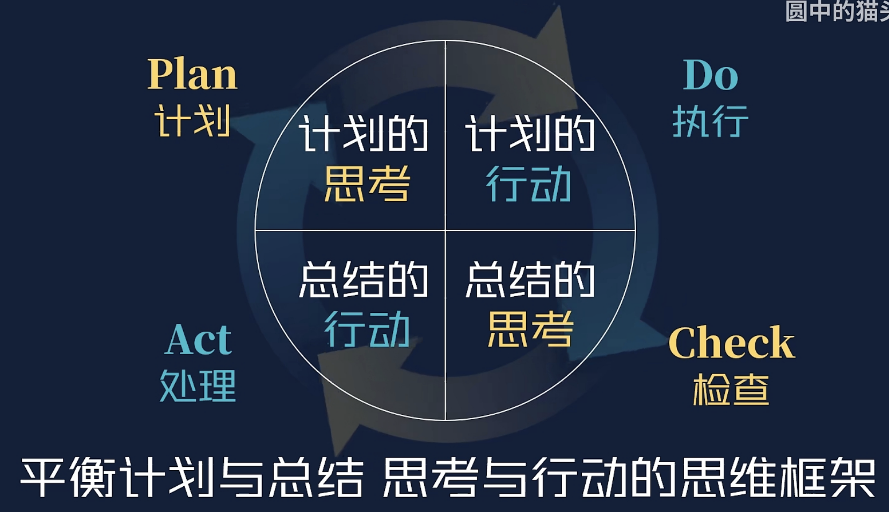

---
# 5W2H模型
What、Why、Where、When、Who、How、How much

思考问题时多问问自己5W2H。

## 适用场景

**作用**：让任务/需求描述清晰、规范。

- 撰写需求文档（PRD）

- 项目需求澄清

- 制定方案/流程优化

---
# SWOT模型

Strength（优势）、Weakness（劣势）、Opportunities（机会）、Threats（威胁）

SWOT模型应用中不能简单把当下的优势和劣势作为优劣势，未来的优势和劣势当作机会和威胁。SWOT模型分析的区分是以内外部和有利不利来划分的。

内部有利为优势、内部不利为劣势、外部有利为机会、外部不利为威胁

    

**SWOT分析技巧**
- 客观公正评价
- 分清搜集信息的主次

**SWOT模型分析步骤**

梳理独立线索-->提出问题知道方向-->匹配解决方案指导行为

1. 寻找线索

    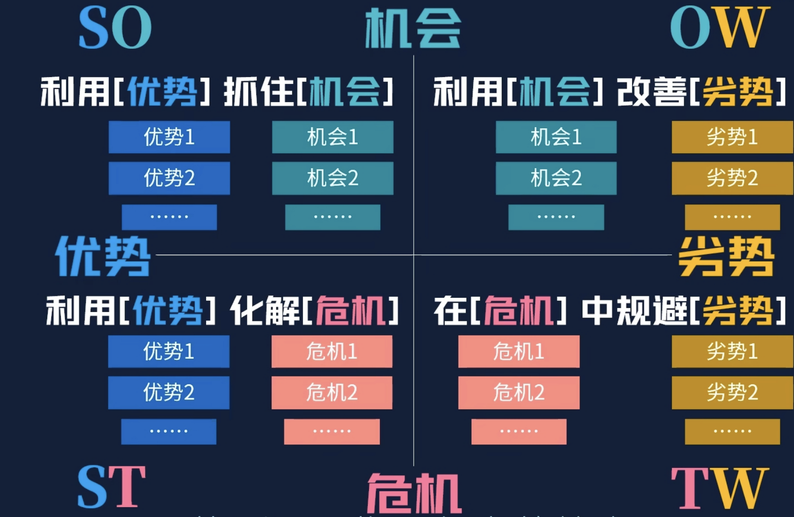

2. 找到解决问题的方向

    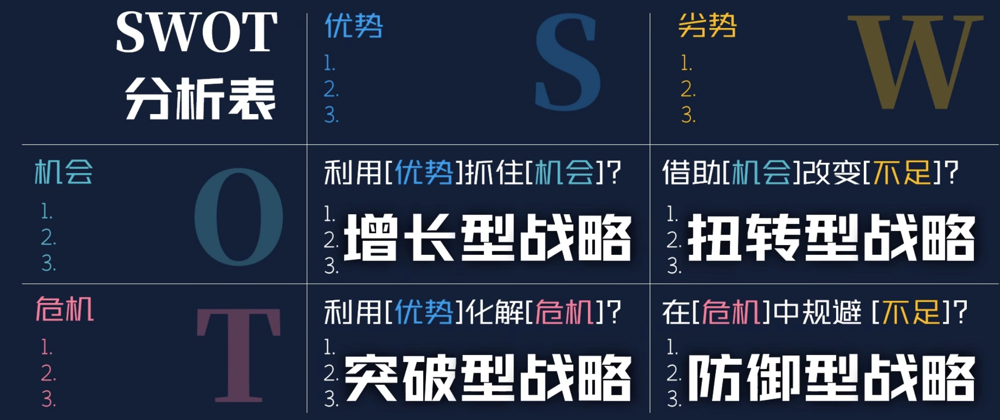

3. 根据收集到的线索进行组合，得到指导行为的答案

可以按照以下表格进行操作

    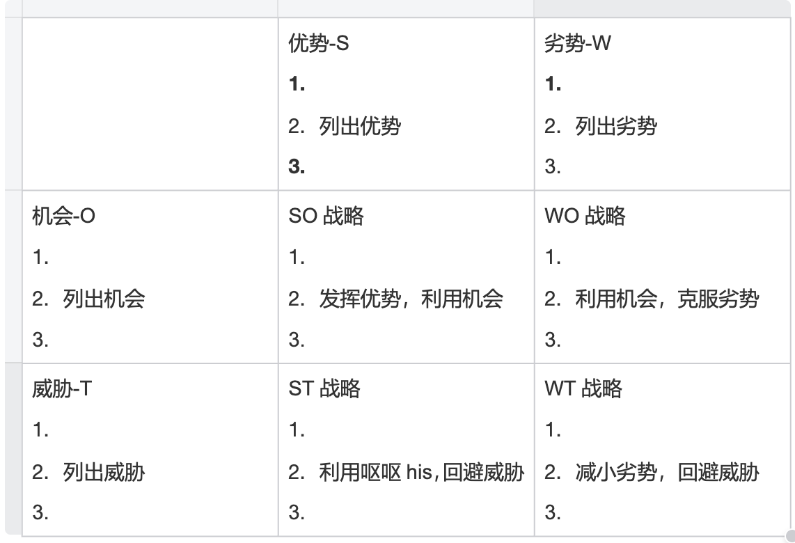

## 适用场景
**作用**：分析企业、产品、个人的内外环境。

- 产品战略分析

- 竞品分析

- 职业规划

---
# 逻辑树

逻辑树就是将复杂问题拆解成一个个小的简单问题。

它的形态像一棵树，把已知的问题比作树干，然后考虑哪些问题或任务与已知问题有关，将这些问题或子任务比作逻辑树的树枝，一个大的树枝上还可以继续延伸出更小的树枝，树枝上又有树叶，逐步列出所有与已知问题相关联的问题。问题分的越细所对应的解决问题的方法也就越具体。

    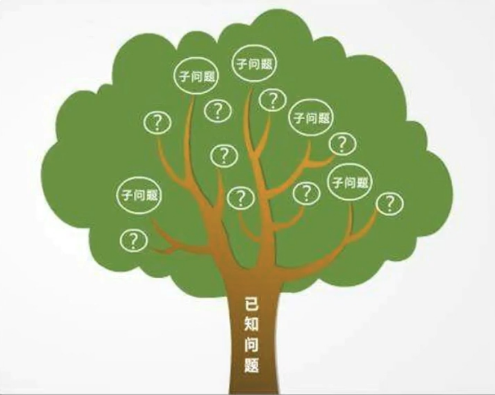

**逻辑树的优点**

1. 通过问题的拆分，找出问题的所有相关项，确保问题获得完整解决

2. 通过问题与问题的关联，识别哪些是必须的，那些是证明前提假设的重点

3. 个人使用，能够帮助理清思路，将大问题分解为利于操作的小问题

4. 团队使用，能将大问题拆分为小问题再落实到个人，避免全责不清

#### 逻辑树例子

    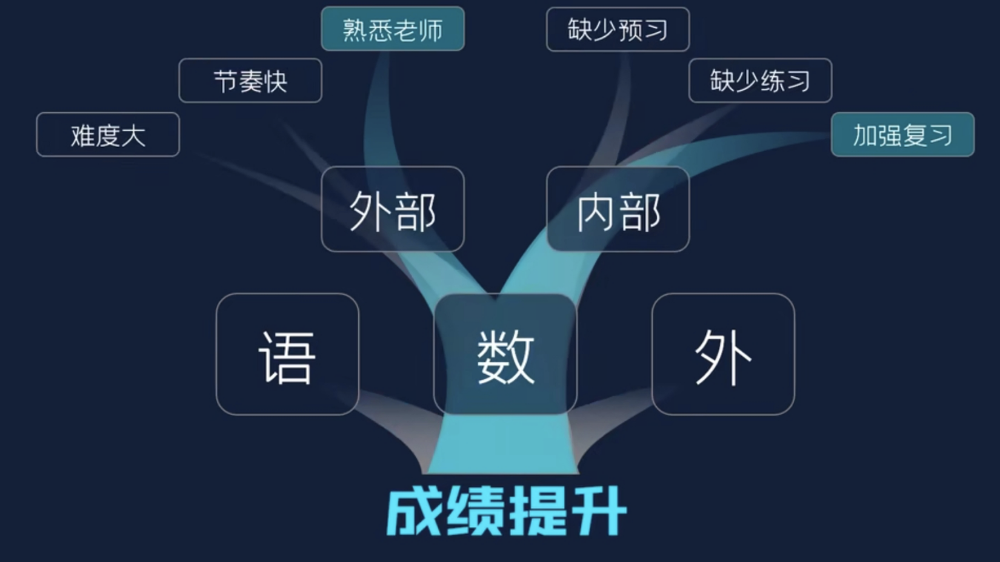

问题本身就是问题的解决方案。

    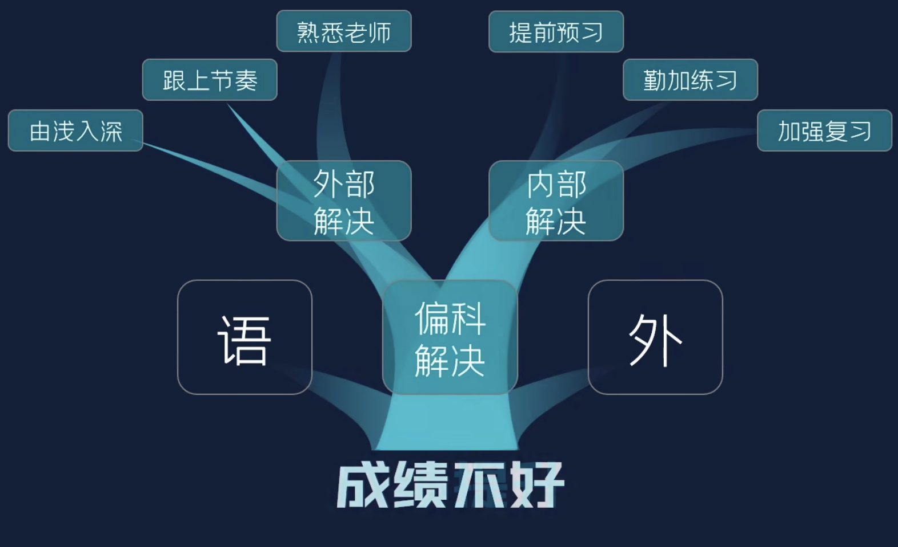

## 适用场景
**作用**：结构化分析复杂问题，辅助决策。

- 分析转化下降的原因

- 分解流量构成

- 制定增长策略

---
# 用户价值分析RFM
通过 最近消费（Rcency）、购买频率（Frequency）、消费体量（Monetary） 分割用户，为不同的客户提供不同策略提高有效的ROI。

通过RFM的高低吧客户分为8个群体，提供针对性的运营策略。

    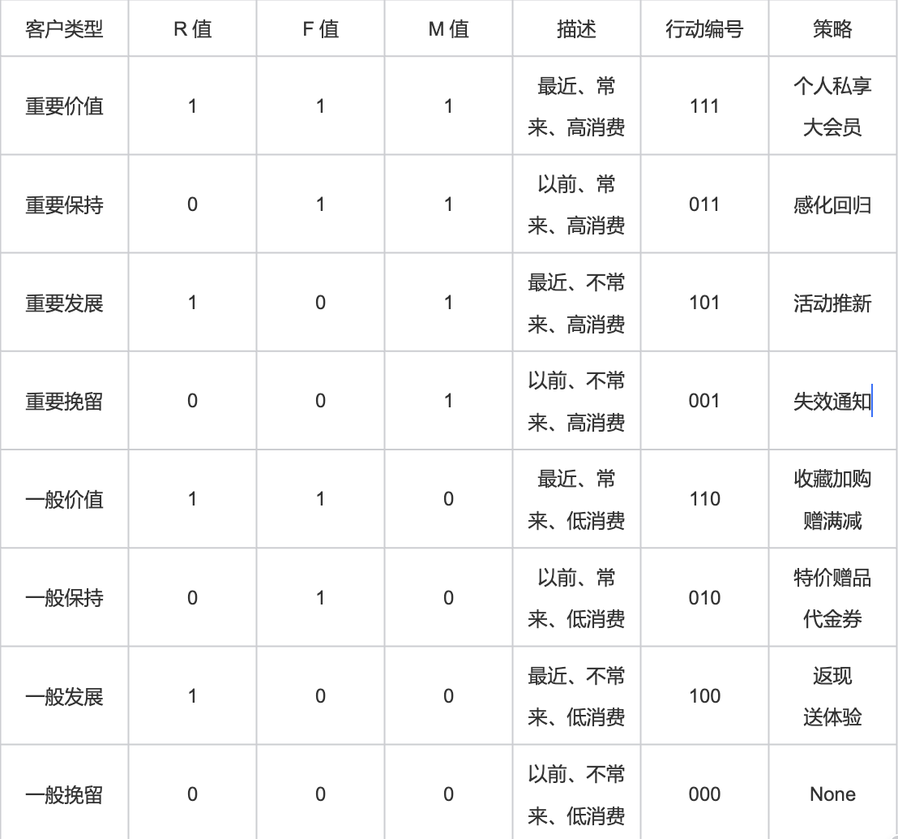

R值为1说明最近有购买，F值为1说明购买频率高，M值为1说明总和花费高。

重要价值客户和一般客户的发展策略的区别，前者的忠诚度高，只要保持一定的关注度和同时提供一些专属优惠就可以了，但是对一般的客户，需要增加对他们的关注，以及加一些积分奖励之类的手段来刺激他们的消费。

采用挽留的策略，重要挽留客户需要提供关怀回访或者一些大额的个性化优惠，对流失客户来说，其实就顺其自然的让它流失了，这个也是事物发展的必经阶段。但是需要注意的是，如果我们只是很简单的将策略应用在某一类的所有用户身上，就难免会出现一些潜在的问题。比如说重要挽回客户这一个群体，它的特点是最近没有消费，消费的频率比较低，消费金额高，那这部分群体当中可能有部分是忠诚度很高的客户，只是他比较喜欢囤货而已。那囤货客户的特征一般是它的消费频率都很低，但是一买就是大手笔，那忠诚度这么高，其实我们没有必要花心思去挽留。

又比如说一般客户最近没有消费频率高，且消费金额低。这一部分当中有一部分可能是喜欢薅羊毛的客户，他们只会在促销活动时进行一些数额比较低的消费，那如果又在他们身上花心思的话，那其实就跟钱跟把钱往水里扔没什么区别。所以要同时考虑 RFM 这三个指标，不能盲目使用营销策略，那结果往往不尽人意。

#### RFM分析的适用
RFM分析优点：需要的数据维度少，只需要用户ID、付费时间、付费金额就行，分析过程很简单，分析结果清晰。

RFM分析适用于已付费用户，且适用于电商复购流程短、复购多的业务场景。不适用家具、交配、房产、汽车、家电等，这些买前考虑时间长，复购率低，需求具有阶段性，这些特点用户会花很多时间体验什么的，这样影响支付的因素就会很多，只看RFM判断就不准了。

RFM模型还可以进心更加细致的切割，可以将每个维度分割为更多层级，从而确定更加细致的策略。但这样客户类型自然就变多了，但是分析师要注意自己的数据量，别种类数高于客户数了。

## 适用场景

**作用**：对用户进行价值分层，实现精细化运营。

- 用户分群（核心、高价值、沉睡用户）

- 精准营销（不同用户给不同运营策略）

- 提升留存、提升用户体验

---
# 鱼骨图
鱼骨图是一种通过头脑风暴法找出影响问题的因素从而发现问题根本原因的分析图形。

鱼骨图通过头脑风暴法集思广益，发挥团体的智慧，从各种不同角度找出问题的所有原因或构成要素，帮助我们找出引起问题的潜在根本原因，能说明出各个原因之间如何相互影响，并表现出各个可能原因是如何随时间而依次出现，有助于采取补救措施，正确行动解决问题。

    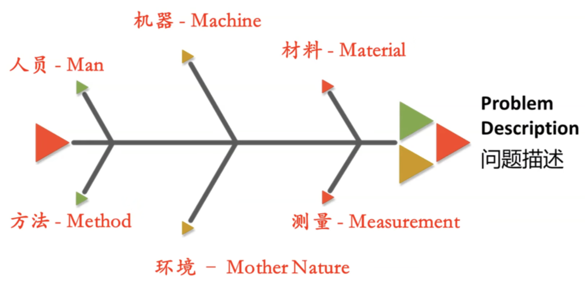

| 类别                         | 含义         | 产品场景示例        |
| -------------------------- | ---------- | ------------- |
| **Man（人）**                 | 相关人员因素     | 研发疏忽、客服培训不足   |
| **Machine（设备/技术）**         | 技术、系统、设备问题 | 服务器不稳定、接口超时   |
| **Method（方法/流程）**          | 流程、规范、方法   | 需求评审不到位       |
| **Material（输入资源）**         | 数据、素材等输入问题 | 数据源质量差、素材审核不严 |
| **Measurement（指标/测量）**     | 数据监控与统计问题  | 指标定义不清，埋点错误   |
| **Mother Environment（环境）** | 外部环境变化     | 政策变化、竞品活动影响   |

## 适用场景

**作用**：系统性找出问题的根因。

- 排查用户投诉原因

- 分析转化率低原因

- 排查 Bug、运营异常